# TASK 0: Create your first webpage
**Fichier attendu:** 0-index.html
**Directory:** html_advanced

## Objectif:
Créer un premier fichier HTML avec une structure de base suivant les spécifications exactes.

## Instructions détaillées:

1. Création du répertoire et fichier:
```bash
mkdir -p holbertonschool-web_front_end/html_advanced
cd holbertonschool-web_front_end/html_advanced
touch 0-index.html
```

2. Structure du code:
```html
<!DOCTYPE html>
<html lang="en" dir="ltr">
</html>
```

3. Structure visuelle:

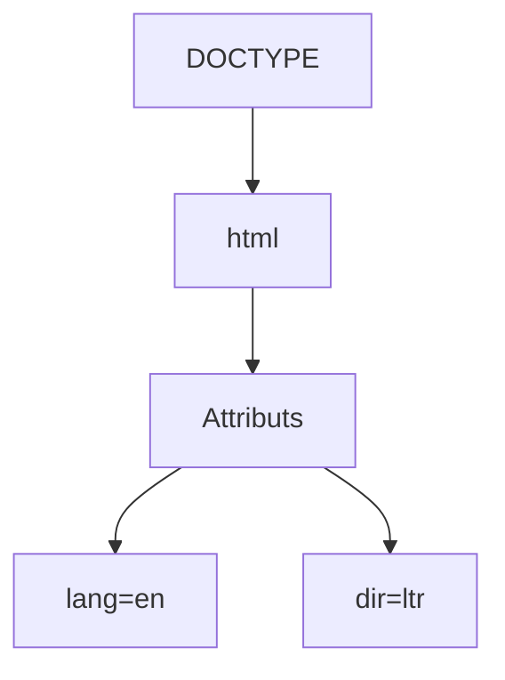

## Points de vérification:
✓ DOCTYPE en première ligne
✓ Pas de commentaires
✓ Balise html avec attributs lang="en" et dir="ltr"
✓ Page blanche à l'affichage
✓ Ignorer les erreurs W3C

## Test:
```bash
# Ouvrir dans le navigateur
google-chrome 0-index.html
# ou
firefox 0-index.html
```

# TASK 1: Structure your webpage
**Fichier attendu:** 1-index.html
**Directory:** html_advanced

## Objectif:
Ajouter les sections head et body à la structure HTML.

## Instructions détaillées:

1. Copier le fichier précédent:
```bash
cp 0-index.html 1-index.html
```

2. Structure du code:
```html
<!DOCTYPE html>
<html lang="en" dir="ltr">
    <head>
    </head>
    <body>
    </body>
</html>
```

3. Structure visuelle:

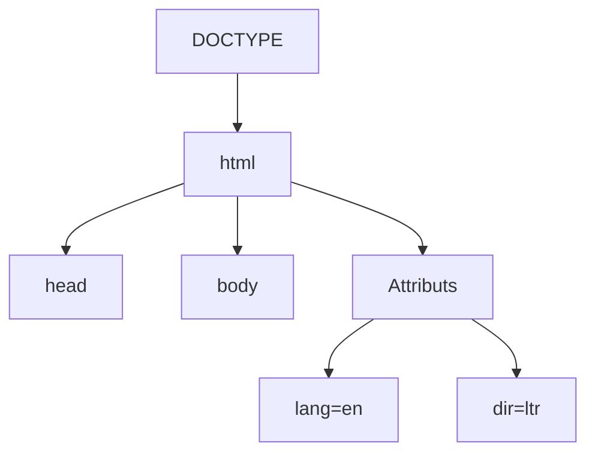

## Points de vérification:
✓ Copie exacte du contenu de 0-index.html
✓ Ajout des balises head et body vides
✓ Respect de l'ordre head puis body
✓ Ignorer les erreurs W3C

# TASK 2: The head - meta charset, viewport, title, description, favicons
**Fichier attendu:** 2-index.html

## Instructions détaillées:
```bash
cp 1-index.html 2-index.html
```

```html
<!DOCTYPE html>
<html lang="en" dir="ltr">
    <head>
        <meta charset="utf-8">
        <meta name="viewport" content="width=device-width, initial-scale=1.0, viewport-fit=cover">
        <title>Homepage - Techium</title>
        <meta name="description" content="Techium is a digital agency">
        <link rel="icon" type="image/x-icon" href="./favicon.ico">
        <link rel="icon" type="image/png" href="./favicon.png">
    </head>
    <body>
    </body>
</html>
```

# TASK 3: Simple header, main, footer
**Fichier attendu:** 3-index.html

```html
<!DOCTYPE html>
<html lang="en" dir="ltr">
    <head>
        <meta charset="utf-8">
        <meta name="viewport" content="width=device-width, initial-scale=1.0, viewport-fit=cover">
        <title>Homepage - Techium</title>
        <meta name="description" content="Techium is a digital agency">
        <link rel="icon" type="image/x-icon" href="./favicon.ico">
        <link rel="icon" type="image/png" href="./favicon.png">
    </head>
    <body>
        <header>
            Header
        </header>
        <main>
            Main content
        </main>
        <footer>
            Footer
        </footer>
    </body>
</html>
```

# TASK 4: Aside
**Fichier attendu:** article.html

```html
<!DOCTYPE html>
<html lang="en" dir="ltr">
    <head>
        <meta charset="utf-8">
        <meta name="viewport" content="width=device-width, initial-scale=1.0, viewport-fit=cover">
        <title>Article - Techium</title>
        <meta name="description" content="Techium is a digital agency">
        <link rel="icon" type="image/x-icon" href="./favicon.ico">
        <link rel="icon" type="image/png" href="./favicon.png">
    </head>
    <body>
        <header>
            Header
        </header>
        <main>
            Main content
            <aside>
                Aside
            </aside>
        </main>
        <footer>
            Footer
        </footer>
    </body>
</html>
```

# TASK 5: Section
**Fichier attendu:** 5-index.html

```html
<!DOCTYPE html>
<html lang="en" dir="ltr">
    <head>
        <meta charset="utf-8">
        <meta name="viewport" content="width=device-width, initial-scale=1.0, viewport-fit=cover">
        <title>Homepage - Techium</title>
        <meta name="description" content="Techium is a digital agency">
        <link rel="icon" type="image/x-icon" href="./favicon.ico">
        <link rel="icon" type="image/png" href="./favicon.png">
    </head>
    <body>
        <header>
            Header
        </header>
        <main>
            <section>Hero section</section>
            <section>Services section</section>
            <section>Works section</section>
            <section>About section</section>
            <section>Latest news section</section>
            <section>Testimonials section</section>
            <section>Contact section</section>
        </main>
        <footer>
            Footer
        </footer>
    </body>
</html>
```

Structure visuelle pour Task 2-5:

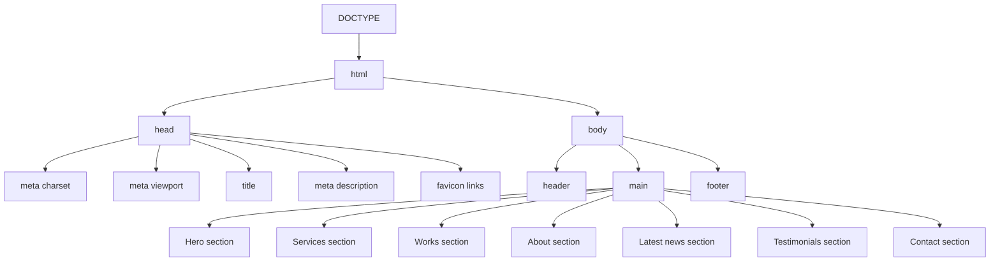
# TASK 6: Work, News, Testimonial articles
**Fichier attendu:** 6-index.html

```html
<!DOCTYPE html>
<html lang="en" dir="ltr">
    <head>
        <meta charset="utf-8">
        <meta name="viewport" content="width=device-width, initial-scale=1.0, viewport-fit=cover">
        <title>Homepage - Techium</title>
        <meta name="description" content="Techium is a digital agency">
        <link rel="icon" type="image/x-icon" href="./favicon.ico">
        <link rel="icon" type="image/png" href="./favicon.png">
    </head>
    <body>
        <header>
            Header
        </header>
        <main>
            <section>Hero section</section>
            <section>Services section</section>
            <section>
                Works section
                <article>Work 1</article>
                <article>Work 2</article>
                <article>Work 3</article>
            </section>
            <section>About section</section>
            <section>
                Latest news section
                <article>Article 1</article>
                <article>Article 2</article>
                <article>Article 3</article>
            </section>
            <section>
                Testimonials section
                <article>Testimonial 1</article>
                <article>Testimonial 2</article>
                <article>Testimonial 3</article>
            </section>
            <section>Contact section</section>
        </main>
        <footer>
            Footer
        </footer>
    </body>
</html>
```

# TASK 7: Navigation
**Fichier attendu:** 7-index.html

```html
<!DOCTYPE html>
<html lang="en" dir="ltr">
    <head>
        <!-- Same head content -->
    </head>
    <body>
        <header>
            <nav></nav>
        </header>
        <!-- Same content as 6-index.html -->
    </body>
</html>
```

# TASK 8: Level 1 headings
**Fichier attendu:** 8-index.html

```html
<!DOCTYPE html>
<html lang="en" dir="ltr">
    <head>
        <!-- Same head content -->
    </head>
    <body>
        <header>
            <nav></nav>
        </header>
        <main>
            <h1>Homepage</h1>
            <!-- Same sections as 7-index.html -->
        </main>
        <footer>
            Footer
        </footer>
    </body>
</html>
```

# TASK 9: Level 2 headings
**Fichier attendu:** 9-index.html

```html
<!DOCTYPE html>
<html lang="en" dir="ltr">
    <head>
        <!-- Same head content -->
    </head>
    <body>
        <header>
            <nav></nav>
        </header>
        <main>
            <h1>Homepage</h1>
            <section>
                <h2>We help you build your brand!</h2>
            </section>
            <section>
                <h2>Services</h2>
            </section>
            <section>
                <h2>Works</h2>
                <article>Work 1</article>
                <article>Work 2</article>
                <article>Work 3</article>
            </section>
            <section>
                <h2>About Us</h2>
            </section>
            <section>
                <h2>Latest news</h2>
                <article>Article 1</article>
                <article>Article 2</article>
                <article>Article 3</article>
            </section>
            <section>
                <h2>Testimonials</h2>
                <article>Testimonial 1</article>
                <article>Testimonial 2</article>
                <article>Testimonial 3</article>
            </section>
            <section>
                <h2>Contact</h2>
            </section>
        </main>
        <footer>Footer</footer>
    </body>
</html>
```

Structure visuelle pour Task 6-9:

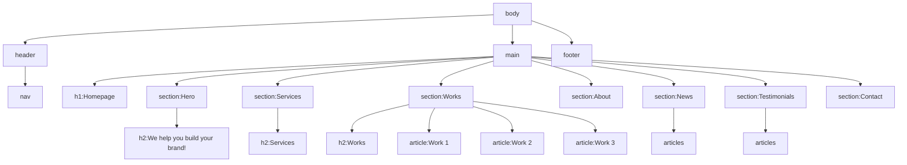
# TASK 10: Level 3 headings
**Fichier attendu:** 10-index.html

```html
<!DOCTYPE html>
<html lang="en" dir="ltr">
    <head>
        <!-- Same head content -->
    </head>
    <body>
        <header>
            <nav></nav>
        </header>
        <main>
            <h1>Homepage</h1>
            <section>
                <h2>We help you build your brand!</h2>
            </section>
            <section>
                <h2>Services</h2>
                <h3>Design & Concept</h3>
                <h3>Digital Strategy</h3>
                <h3>Content Strategy</h3>
                <h3>UX Design</h3>
                <h3>Web Development</h3>
                <h3>Social Media</h3>
            </section>
            <section>
                <h2>Works</h2>
                <article>
                    <h3>Interior Design</h3>
                </article>
                <article>
                    <h3>Web Development</h3>
                </article>
                <article>
                    <h3>Personal Brand</h3>
                </article>
            </section>
            <section>
                <h2>About Us</h2>
                <h3>Who are we</h3>
                <h3>Our culture</h3>
                <h3>How we work</h3>
            </section>
            <section>
                <h2>Latest news</h2>
                <article>
                    <h3>Hoc loco tenere se Triarius non potuit.</h3>
                </article>
                <article>
                    <h3>Ut alios omittam, hunc appello, quem ille unum secutus est.</h3>
                </article>
                <article>
                    <h3>Bestiarum vero nullum iudicium puto.</h3>
                </article>
            </section>
            <section>
                <h2>Testimonials</h2>
                <article>Testimonial 1</article>
                <article>Testimonial 2</article>
                <article>Testimonial 3</article>
            </section>
            <section>
                <h2>Contact</h2>
            </section>
        </main>
        <footer>Footer</footer>
    </body>
</html>
```

# TASK 11: styleguide
**Fichier attendu:** 11-styleguide.html

```html
<!DOCTYPE html>
<html lang="en" dir="ltr">
    <head>
        <meta charset="utf-8">
        <meta name="viewport" content="width=device-width, initial-scale=1.0, viewport-fit=cover">
        <title>Styleguide - Techium</title>
        <meta name="description" content="Techium is a digital agency">
        <link rel="icon" type="image/x-icon" href="./favicon.ico">
        <link rel="icon" type="image/png" href="./favicon.png">
    </head>
    <body>
        <header></header>
        <main>
            <section>
                <header>
                    <h2>Headings</h2>
                </header>
                <h1>Heading level 1</h1>
                <h2>Heading level 2</h2>
                <h3>Heading level 3</h3>
                <h4>Heading level 4</h4>
                <h5>Heading level 5</h5>
                <h6>Heading level 6</h6>
            </section>
        </main>
        <footer></footer>
    </body>
</html>
```

Structure visuelle pour Task 10-11:

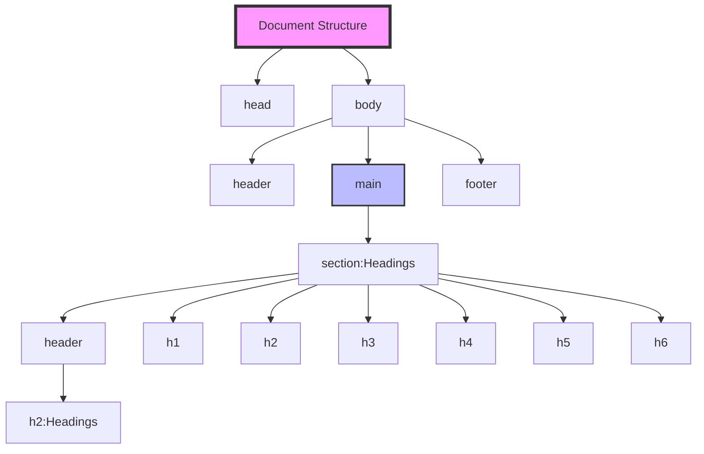

Points de vérification pour les deux tâches :
- Task 10:
  * Tous les h3 sont dans la bonne section
  * Ordre correct des headings
  * Pas de validation W3C nécessaire

- Task 11:
  * Titre changé en "Styleguide - Techium"
  * Structure correcte des headings dans la section
  * Header, main et footer vides sauf pour la section spécifiée

# TASK 12: Paragraphs
**Fichier attendu:** 12-index.html

Je vais diviser cette tâche complexe en sections :

1. About Us paragraphes:
```html
<section>
    <h2>About Us</h2>
    <h3>Who are we</h3>
    <p>
        Lorem ipsum dolor sit amet, consectetur adipisicing elit. Ipsum, omnis expedita! Eum, praesentium cumque accusantium rem, sit quaerat est nisi ratione, deserunt ducimus quidem iste dicta quibusdam atque maxime cum!
    </p>
    <h3>Our culture</h3>
    <p>
        Lorem ipsum dolor sit amet, consectetur adipisicing elit. Ipsum, omnis expedita! Eum, praesentium cumque accusantium rem, sit quaerat est nisi ratione, deserunt ducimus quidem iste dicta quibusdam atque maxime cum!
    </p>
    <h3>How we work</h3>
    <p>
        Lorem ipsum dolor sit amet, consectetur adipisicing elit. Ipsum, omnis expedita! Eum, praesentium cumque accusantium rem, sit quaerat est nisi ratione, deserunt ducimus quidem iste dicta quibusdam atque maxime cum!
    </p>
</section>
```

2. Latest news paragraphes:
```html
<section>
    <h2>Latest news</h2>
    <article>
        <p>Career</p>
        <h3>Hoc loco tenere se Triarius non potuit.</h3>
        <p>Lorem ipsum dolor sit amet, consectetur adipiscing elit. Id Sextilius factum negabat. Quo tandem modo? At eum nihili facit; Quae contraria sunt his, malane?</p>
    </article>
    <article>
        <p>Digital Life</p>
        <h3>Ut alios omittam, hunc appello, quem ille unum secutus est.</h3>
        <p>Lorem ipsum dolor sit amet, consectetur adipiscing elit. Tum mihi Piso: Quid ergo? Tum ille: Ain tandem? Non autem hoc: igitur ne illud quidem. Sed quod proximum fuit non vidit. Nos commodius agimus. An nisi populari fama?</p>
    </article>
    <article>
        <p>Social</p>
        <h3>Bestiarum vero nullum iudicium puto.</h3>
        <p>Lorem ipsum dolor sit amet, consectetur adipiscing elit. Non igitur bene. Quid enim est a Chrysippo praetermissum in Stoicis? Pugnant Stoici cum Peripateticis. Prioris generis est docilitas, memoria; Apparet statim, quae sint officia, quae actiones.</p>
    </article>
</section>
```

3. Contact paragraphe:
```html
<section>
    <h2>Contact</h2>
    <p>Lorem ipsum dolor sit amet, consectetur adipiscing elit. Id Sextilius factum negabat. Quo tandem modo? At eum nihili facit; Quae contraria sunt his, malane?</p>
</section>
```

4. Paragraphes additionnels :
```html
<section>
    <h2>Services</h2>
    <p>We work with you</p>
    <!-- ... reste de la section ... -->
</section>

<section>
    <h2>Works</h2>
    <p>Take a look in our portfolio</p>
    <!-- ... reste de la section ... -->
</section>

<section>
    <h2>About Us</h2>
    <p>Everything about us</p>
    <!-- ... reste de la section ... -->
</section>

<section>
    <h2>Testimonials</h2>
    <p>We are more than a digital company</p>
    <!-- ... reste de la section ... -->
</section>

<section>
    <h2>Contact</h2>
    <p>We like to know new people</p>
    <!-- ... reste de la section ... -->
</section>
```

Structure visuelle:

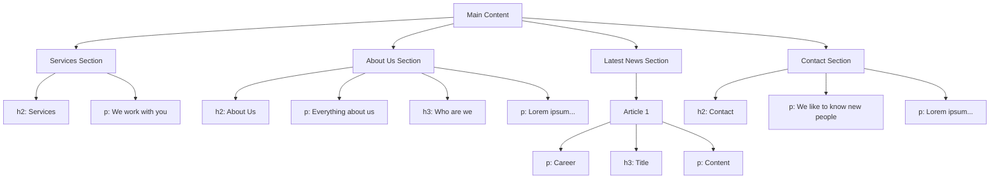

Points de vérification :
- Tous les paragraphes sont placés correctement
- L'ordre est respecté dans chaque section
- Le texte Lorem ipsum est complet et exact
- La hiérarchie des titres est maintenue
- Les paragraphes d'introduction sont placés après les h2

# TASK 13: styleguide paragraphs
**Fichier attendu:** 13-styleguide.html

```html
<!DOCTYPE html>
<html lang="en" dir="ltr">
    <head>
        <meta charset="utf-8">
        <meta name="viewport" content="width=device-width, initial-scale=1.0, viewport-fit=cover">
        <title>Styleguide - Techium</title>
        <meta name="description" content="Techium is a digital agency">
        <link rel="icon" type="image/x-icon" href="./favicon.ico">
        <link rel="icon" type="image/png" href="./favicon.png">
    </head>
    <body>
        <header></header>
        <main>
            <!-- Section précédente pour les headings -->
            <section>
                <header>
                    <h2>Headings</h2>
                </header>
                <h1>Heading level 1</h1>
                <h2>Heading level 2</h2>
                <h3>Heading level 3</h3>
                <h4>Heading level 4</h4>
                <h5>Heading level 5</h5>
                <h6>Heading level 6</h6>
            </section>
            
            <!-- Nouvelle section pour les paragraphes -->
            <section>
                <header>
                    <h2>Paragraph</h2>
                </header>
                
                <h2>Heading with a subtitle</h2>
                <p>This is my subtitle</p>
                <p>
                    Nunc lacinia ante nunc ac lobortis. Interdum adipiscing gravida odio porttitor sem non mi integer non faucibus ornare mi ut ante amet placerat aliquet. Volutpat eu sed ante lacinia sapien lorem accumsan varius montes viverra nibh in adipiscing blandit tempus accumsan.
                </p>
            </section>
        </main>
        <footer></footer>
    </body>
</html>
```

# TASK 14: Span
**Fichier attendu:** 14-index.html

```html
<!DOCTYPE html>
<html lang="en" dir="ltr">
    <head>
        <!-- Same head content -->
    </head>
    <body>
        <header>
            <span>Techium</span>
            <nav></nav>
        </header>
        <!-- Rest of the content remains the same -->
    </body>
</html>
```

# TASK 15: Div
**Fichier attendu:** 15-index.html

```html
<!DOCTYPE html>
<html lang="en" dir="ltr">
    <head>
        <!-- Same head content -->
    </head>
    <body>
        <header>
            <div>
                <span>Techium</span>
                <nav></nav>
            </div>
        </header>
        <main>
            <div>
                <!-- Wrap each section content in a div -->
                <section>
                    <div>
                        <!-- Section content -->
                    </div>
                </section>
                <!-- Repeat for all sections -->
            </div>
        </main>
        <footer>
            <div>
                <!-- Footer content -->
            </div>
        </footer>
    </body>
</html>
```

Structure visuelle:

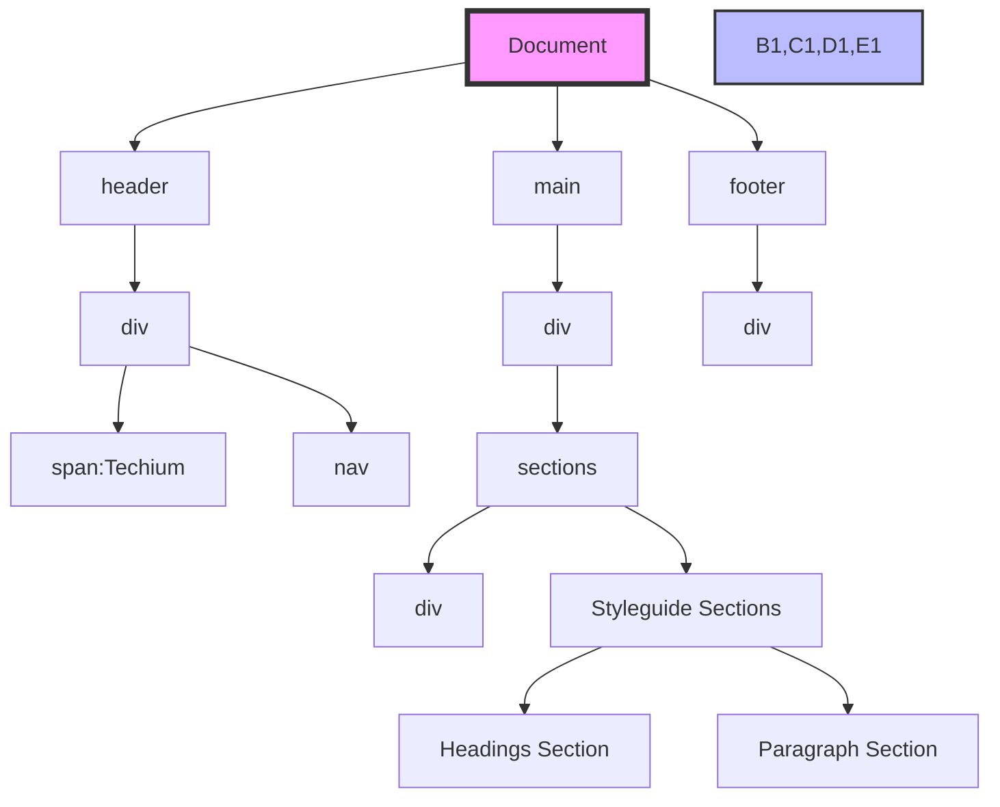

Points de vérification:
- Task 13:
  * Nouvelle section ajoutée après la section des headings
  * Structure correcte du header avec h2
  * Paragraphes correctement placés

- Task 14:
  * Span ajouté avant nav dans le header
  * Texte "Techium" dans le span

- Task 15:
  * Tous les contenus sont enveloppés dans des div
  * Hiérarchie correcte des div
  * Structure originale maintenue

# TASK 16: Structure your sections
**Fichier attendu:** 16-index.html

```html
<!DOCTYPE html>
<html lang="en" dir="ltr">
    <head>
        <!-- Same head content -->
    </head>
    <body>
        <header>
            <div>
                <span>Techium</span>
                <nav></nav>
            </div>
        </header>
        <main>
            <!-- Services section avec nouvelle structure -->
            <section>
                <header>
                    <h2>Services</h2>
                    <p>We work with you</p>
                </header>
                <div>
                    <h3>Design & Concept</h3>
                    <h3>Digital Strategy</h3>
                    <h3>Content Strategy</h3>
                    <h3>UX Design</h3>
                    <h3>Web Development</h3>
                    <h3>Social Media</h3>
                </div>
            </section>

            <!-- Works section avec nouvelle structure -->
            <section>
                <header>
                    <h2>Works</h2>
                    <p>Take a look in our portfolio</p>
                </header>
                <div>
                    <article>
                        <h3>Interior Design</h3>
                    </article>
                    <article>
                        <h3>Web Development</h3>
                    </article>
                    <article>
                        <h3>Personal Brand</h3>
                    </article>
                </div>
            </section>

            <!-- About Us section avec nouvelle structure -->
            <section>
                <header>
                    <h2>About Us</h2>
                    <p>Everything about us</p>
                </header>
                <div>
                    <h3>Who are we</h3>
                    <p>Lorem ipsum...</p>
                    <h3>Our culture</h3>
                    <p>Lorem ipsum...</p>
                    <h3>How we work</h3>
                    <p>Lorem ipsum...</p>
                </div>
            </section>

            <!-- Latest news section avec nouvelle structure -->
            <section>
                <header>
                    <h2>Latest news</h2>
                </header>
                <div>
                    <article>
                        <p>Career</p>
                        <h3>Hoc loco tenere se Triarius non potuit.</h3>
                        <p>Lorem ipsum...</p>
                    </article>
                    <!-- Repeat for other articles -->
                </div>
            </section>

            <!-- Testimonials section avec nouvelle structure -->
            <section>
                <header>
                    <h2>Testimonials</h2>
                    <p>We are more than a digital company</p>
                </header>
                <div>
                    <article>Testimonial 1</article>
                    <article>Testimonial 2</article>
                    <article>Testimonial 3</article>
                </div>
            </section>

            <!-- Contact section avec nouvelle structure -->
            <section>
                <header>
                    <h2>Contact</h2>
                    <p>We like to know new people</p>
                </header>
                <div>
                    <p>Lorem ipsum...</p>
                </div>
            </section>
        </main>
        <footer>
            <div>Footer</div>
        </footer>
    </body>
</html>
```

Structure visuelle:

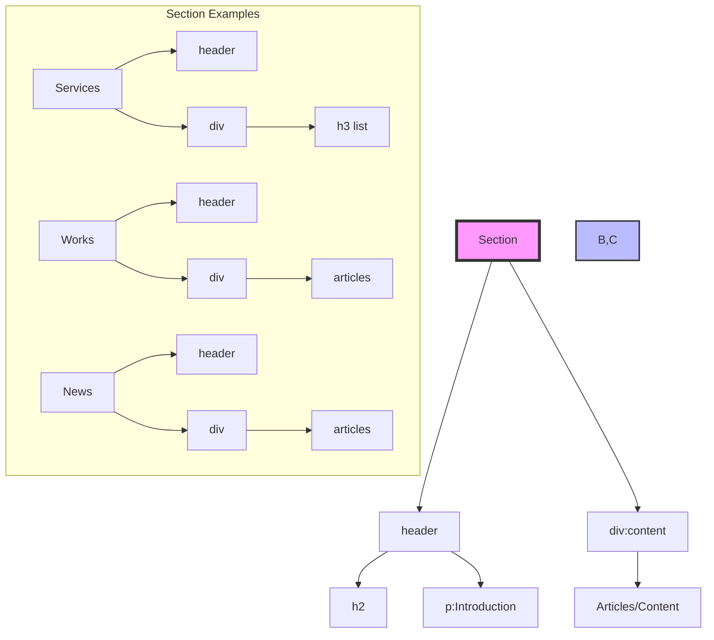

Points de vérification:
1. Chaque section contient:
   - Un header avec h2
   - Un div pour le contenu principal
2. Les headers contiennent:
   - Le titre h2
   - Le paragraphe d'introduction (quand requis)
3. La structure est identique pour toutes les sections
4. Les contenus originaux sont préservés
5. La hiérarchie est respectée

# TASK 17: Comments
**Fichier attendu:** 17-index.html

Ajout des commentaires aux sections principales :

```html
<!DOCTYPE html>
<html lang="en" dir="ltr">
    <head>
        <!-- Same head content -->
    </head>
    <body>
        <!-- Header -->
        <header>
            <div>
                <span>Techium</span>
                <nav></nav>
            </div>
        </header>

        <!-- Main -->
        <main>
            <!-- Hero section -->
            <section>
                <div>
                    <h2>We help you build your brand!</h2>
                </div>
            </section>

            <!-- Services section -->
            <section>
                <div>
                    <header>
                        <h2>Services</h2>
                        <p>We work with you</p>
                    </header>
                    <!-- Services content -->
                </div>
            </section>

            <!-- Works section -->
            <section>
                <div>
                    <header>
                        <h2>Works</h2>
                        <p>Take a look in our portfolio</p>
                    </header>
                    <!-- Works content -->
                </div>
            </section>

            <!-- About Us section -->
            <section>
                <div>
                    <header>
                        <h2>About Us</h2>
                        <p>Everything about us</p>
                    </header>
                    <!-- About content -->
                </div>
            </section>

            <!-- Latest news section -->
            <section>
                <div>
                    <header>
                        <h2>Latest news</h2>
                    </header>
                    <!-- News content -->
                </div>
            </section>

            <!-- Testimonials section -->
            <section>
                <div>
                    <header>
                        <h2>Testimonials</h2>
                        <p>We are more than a digital company</p>
                    </header>
                    <!-- Testimonials content -->
                </div>
            </section>

            <!-- Contact section -->
            <section>
                <div>
                    <header>
                        <h2>Contact</h2>
                        <p>We like to know new people</p>
                    </header>
                    <!-- Contact content -->
                </div>
            </section>
        </main>

        <!-- Footer -->
        <footer>
            <div>
                Footer
            </div>
        </footer>
    </body>
</html>
```

Structure des commentaires:

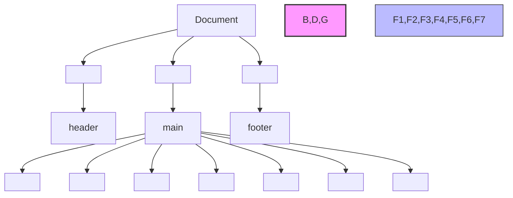

Points de vérification:
1. Tous les commentaires sont ajoutés avec un saut de ligne avant
2. Les commentaires sont placés juste avant chaque section principale
3. Ordre des commentaires:
   - Header
   - Main
   - Hero section
   - Services section
   - Works section
   - About Us section
   - Latest news section
   - Testimonials section
   - Contact section
   - Footer
4. La structure existante reste intacte
5. Les commentaires sont uniquement en anglais

# TASK 18: link your logo
**Fichier attendu:** 18-index.html

Modification du header pour inclure le lien logo:

```html
<header>
    <div>
        <div>
            <a href="/">
                <span>Techium</span>
            </a>
        </div>
        <nav></nav>
    </div>
</header>
```

Points clés:
- Ajout de la balise `<a>` avec href="/"
- Span "Techium" à l'intérieur du lien
- Lien enveloppé dans un div
- Navigation reste inchangée

# TASK 19: Create new pages
**Fichiers attendus:** about.html, latest_news.html, contact.html

Créer trois nouveaux fichiers basés sur 18-index.html avec les modifications suivantes :

1. about.html:
```html
<!-- Même contenu que 18-index.html mais avec : -->
<head>
    <title>About - Techium</title>
    <!-- Reste des meta tags identiques -->
</head>
```

2. latest_news.html:
```html
<head>
    <title>Latest news - Techium</title>
    <!-- Reste des meta tags identiques -->
</head>
```

3. contact.html:
```html
<head>
    <title>Contact - Techium</title>
    <!-- Reste des meta tags identiques -->
</head>
```

# TASK 20: Add links
**Fichier attendu:** 20-index.html

Modification de la navigation:
```html
<nav>
    <ul>
        <li><a href="/">Home</a></li>
        <li><a href="#services">Services</a></li>
        <li><a href="#works">Works</a></li>
        <li><a href="#about">About</a></li>
        <li><a href="#latest_news">Latest news</a></li>
        <li><a href="#testimonials">Testimonials</a></li>
        <li><a href="#contact">Contact</a></li>
    </ul>
</nav>
```

Structure visuelle de la navigation:

```mermaid
graph TD
    A[nav] --> B[ul]
    B --> C1[li]
    B --> C2[li]
    B --> C3[li]
    B --> C4[li]
    B --> C5[li]
    B --> C6[li]
    B --> C7[li]
    
    C1 --> D1[a href="/"]
    C2 --> D2[a href="#services"]
    C3 --> D3[a href="#works"]
    C4 --> D4[a href="#about"]
    C5 --> D5[a href="#latest_news"]
    C6 --> D6[a href="#testimonials"]
    C7 --> D7[a href="#contact"]
    
    D1 --> E1[Home]
    D2 --> E2[Services]
    D3 --> E3[Works]
    D4 --> E4[About]
    D5 --> E5[Latest news]
    D6 --> E6[Testimonials]
    D7 --> E7[Contact]

```

# TASK 21: Add social media links
**Fichier attendu:** 21-index.html

Dans le footer, ajout des liens sociaux:
```html
<footer>
    <div>
        <ul>
            <li>
                <a href="https://www.facebook.com/HolbertonSchool/">Facebook</a>
            </li>
            <li>
                <a href="https://twitter.com/holbertonschool">Twitter</a>
            </li>
            <li>
                <a href="https://www.instagram.com/holbertonschool/">Instagram</a>
            </li>
        </ul>
    </div>
</footer>
```

Points de vérification pour les trois tâches:

Task 19:
- Création des trois nouveaux fichiers
- Modification uniquement du titre
- Reste du contenu identique à 18-index.html

Task 20:
- Navigation dans une liste non ordonnée
- Liens avec ancres corrects
- Ordre des liens respecté

Task 21:
- Liens sociaux dans le footer
- URLs exactes
- Textes corrects pour chaque lien

# TASK 22: "Button" links
**Fichier attendu:** 22-index.html

Ajout des liens "boutons" dans différentes sections :

1. Hero section:
```html
<section>
    <div>
        <h2>We help you build your brand!</h2>
        <a href="#">Get started</a>
    </div>
</section>
```

2. About Us section:
```html
<section>
    <div>
        <header>
            <h2>About Us</h2>
            <p>Everything about us</p>
        </header>
        <div>
            <!-- Contenu existant -->
            <a href="about.html">Learn more about us</a>
        </div>
    </div>
</section>
```

3. Contact section:
```html
<section>
    <div>
        <header>
            <h2>Contact</h2>
            <p>We like to know new people</p>
        </header>
        <div>
            <p>Lorem ipsum...</p>
            <a href="contact.html">Get in touch</a>
        </div>
    </div>
</section>
```

# TASK 23: Services, Works, Latest news links
**Fichier attendu:** 23-index.html

Modification des titres h3 pour inclure des liens:

1. Services section:
```html
<div>
    <h3><a href="#">Design & Concept</a></h3>
    <h3><a href="#">Digital Strategy</a></h3>
    <h3><a href="#">Content Strategy</a></h3>
    <h3><a href="#">UX Design</a></h3>
    <h3><a href="#">Web Development</a></h3>
    <h3><a href="#">Social Media</a></h3>
</div>
```

2. Works section:
```html
<div>
    <article>
        <h3><a href="#">Interior Design</a></h3>
    </article>
    <article>
        <h3><a href="#">Web Development</a></h3>
    </article>
    <article>
        <h3><a href="#">Personal Brand</a></h3>
    </article>
</div>
```

3. Latest news section:
```html
<div>
    <article>
        <h3><a href="#">Hoc loco tenere se Triarius non potuit.</a></h3>
        <!-- Reste du contenu -->
    </article>
    <article>
        <h3><a href="#">Ut alios omittam, hunc appello, quem ille unum secutus est.</a></h3>
        <!-- Reste du contenu -->
    </article>
    <article>
        <h3><a href="#">Bestiarum vero nullum iudicium puto.</a></h3>
        <!-- Reste du contenu -->
    </article>
</div>
```

Structure visuelle:

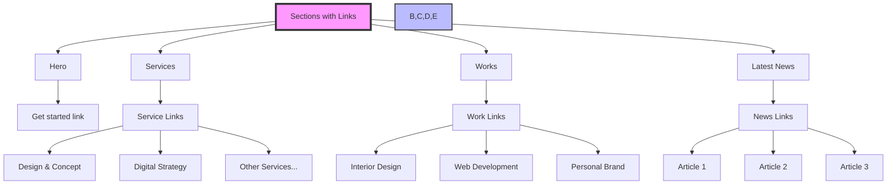

Points de vérification:
1. Task 22:
   - Liens "boutons" ajoutés aux bons endroits
   - Textes exacts pour chaque lien
   - Structure HTML préservée

2. Task 23:
   - Tous les h3 des sections spécifiées sont maintenant des liens
   - Href="#" pour les liens sans destination
   - Conservation de la hiérarchie des éléments

# TASK 24: List the links
**Fichier attendu:** 24-index.html

Modification de la navigation et du footer pour utiliser des listes:

1. Navigation principale:
```html
<nav>
    <ul>
        <li><a href="/">Home</a></li>
        <li><a href="#services">Services</a></li>
        <li><a href="#works">Works</a></li>
        <li><a href="#about">About</a></li>
        <li><a href="#latest_news">Latest news</a></li>
        <li><a href="#testimonials">Testimonials</a></li>
        <li><a href="#contact">Contact</a></li>
    </ul>
</nav>
```

2. Footer social links:
```html
<footer>
    <div>
        <ul>
            <li><a href="https://www.facebook.com/HolbertonSchool/">Facebook</a></li>
            <li><a href="https://twitter.com/holbertonschool">Twitter</a></li>
            <li><a href="https://www.instagram.com/holbertonschool/">Instagram</a></li>
        </ul>
    </div>
</footer>
```

# TASK 25: Secondary navigation menu
**Fichier attendu:** 25-index.html

Ajout d'une navigation secondaire dans le footer:
```html
<footer>
    <div>
        <!-- Social media links -->
        <ul>
            <li><a href="https://www.facebook.com/HolbertonSchool/">Facebook</a></li>
            <li><a href="https://twitter.com/holbertonschool">Twitter</a></li>
            <li><a href="https://www.instagram.com/holbertonschool/">Instagram</a></li>
        </ul>
    </div>
    <div>
        <!-- Secondary navigation -->
        <ul>
            <li><a href="#">Terms of Use</a></li>
            <li><a href="#">Privacy Policy</a></li>
            <li><a href="#">Cookie Policy</a></li>
        </ul>
    </div>
</footer>
```

Structure visuelle:

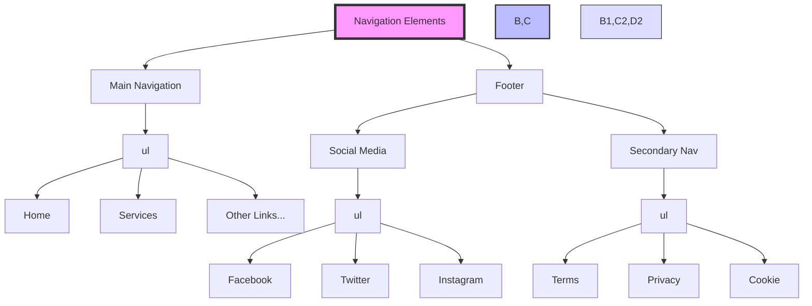

Points de vérification:
1. Task 24:
   - Navigation principale utilise ul/li
   - Liens sociaux dans une liste ul/li
   - Structure et ordre préservés
   - Liens fonctionnels

2. Task 25:
   - Nouvelle div dans le footer
   - Liste ul pour la navigation secondaire
   - 3 liens avec textes exacts
   - Href="#" pour tous les liens secondaires

# TASK 26: Examples of lists for the styleguide
**Fichier attendu:** 26-styleguide.html

Ajout des différents types de listes dans le styleguide:

```html
<section>
    <header>
        <h2>Lists</h2>
    </header>
    <div>
        <!-- Liste non ordonnée -->
        <h3>Unordered</h3>
        <ul>
            <li>Dolor pulvinar etiam magna etiam.</li>
            <li>Sagittis adipiscing lorem eleifend.</li>
            <li>Felis enim feugiat dolore viverra.</li>
        </ul>

        <!-- Liste ordonnée -->
        <h3>Ordered</h3>
        <ol>
            <li>Dolor pulvinar etiam magna etiam.</li>
            <li>Sagittis adipiscing lorem eleifend.</li>
            <li>Felis enim feugiat dolore viverra.</li>
        </ol>

        <!-- Liste de définitions -->
        <h3>Definition</h3>
        <dl>
            <dt>Definition List title</dt>
            <dd>Definition text.</dd>
            <dt>Startup</dt>
            <dd>A startup company or startup is a company or temporary organization designed to search for a repeatable and scalable business model.</dd>
            <dt>Water</dt>
            <dd>A colorless, transparent, odorless liquid that forms the seas, lakes, rivers, and rain and is the basis of the fluids of living organisms.</dd>
        </dl>
    </div>
</section>
```

# TASK 27: Separate content
**Fichier attendu:** 27-index.html

Ajout d'une règle horizontale et d'un copyright dans le footer:

```html
<footer>
    <div>
        <!-- Social media links -->
    </div>
    <hr>
    <p>© 2020 Techium, made with ♥ by students at Holberton School.</p>
</footer>
```

Structure visuelle:

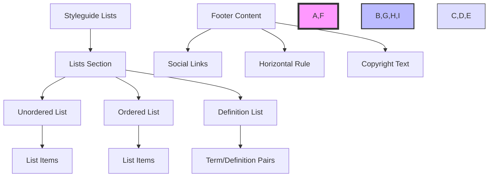

# TASK 28: Horizontal rule example
**Fichier attendu:** 28-styleguide.html

Ajout d'une section pour la règle horizontale dans le styleguide:

```html
<section>
    <header>
        <h2>Horizontal rule</h2>
    </header>
    <div>
        <hr>
    </div>
</section>
```

Points de vérification:
1. Task 26:
   - Trois types de listes différents
   - Texte exact pour chaque élément
   - Structure correcte pour chaque liste
   - Hiérarchie des titres respectée

2. Task 27:
   - Règle horizontale entre les divs
   - Copyright avec symbole ©
   - Symbole ♥ inclus
   - Texte exact

3. Task 28:
   - Nouvelle section après "Lists"
   - Structure header/div respectée
   - Règle horizontale dans le div

# TASK 29: Client quotes
**Fichier attendu:** 29-index.html

Modification de la section Testimonials pour inclure les citations:

```html
<section>
    <header>
        <h2>Testimonials</h2>
        <p>We are more than a digital company</p>
    </header>
    <div>
        <article>
            <blockquote>
                <p>I am completely blown away. Thanks to Techium, we've just launched our 5th website!</p>
                <cite>Yuri Y.</cite>
            </blockquote>
        </article>
        <article>
            <blockquote>
                <p>Thank you so much for your help. Techium company is awesome!</p>
                <cite>Dorrie S.</cite>
            </blockquote>
        </article>
        <article>
            <blockquote>
                <p>I love your system. Definitely worth the investment. I'd be lost without Techium company.</p>
                <cite>Sven H.</cite>
            </blockquote>
        </article>
    </div>
</section>
```

# TASK 30: Examples of quotes
**Fichier attendu:** 30-styleguide.html

Ajout de la section citations dans le styleguide:

```html
<section>
    <header>
        <h2>Blockquotes</h2>
    </header>
    <div>
        <!-- Citation en ligne -->
        <h3>Inline quote</h3>
        <q>Stay hungry. Stay foolish.</q>
    </div>
    <div>
        <!-- Citation en bloc -->
        <h3>Blockquote</h3>
        <blockquote>
            <p>I will be the leader of a company that ends up being worth billions of dollars, because I got the answers. I understand culture. I am the nucleus. I think that's a responsibility that I have, to push possibilities, to show people, this is the level that things could be at.</p>
            <cite>Kanye West, Musician</cite>
        </blockquote>
    </div>
</section>
```

Structure visuelle:

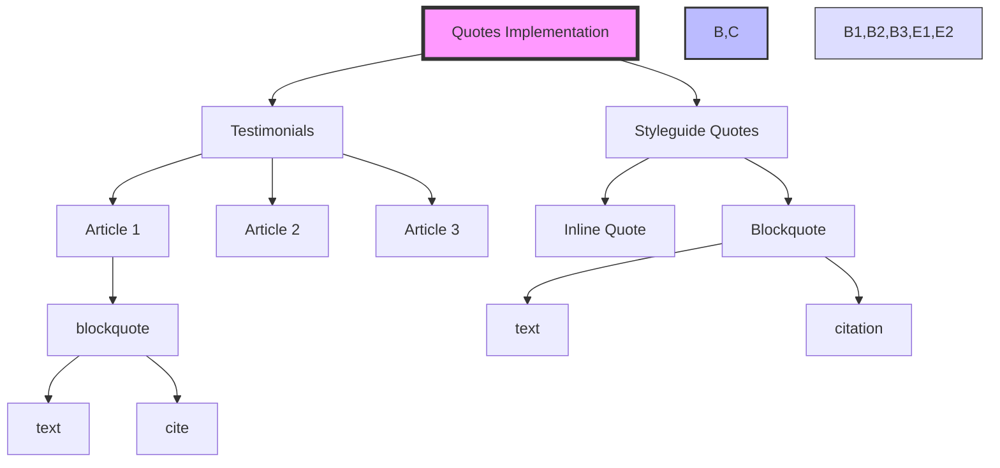

Points de vérification:
1. Task 29:
   - Blockquotes correctement structurés
   - Citations exactes pour chaque témoignage
   - Balises cite utilisées correctement
   - Structure article préservée

2. Task 30:
   - Deux types de citations (inline et block)
   - Citation en ligne avec balise q
   - Blockquote avec citation et auteur
   - Textes exacts

Points importants:
- Utilisation correcte des balises sémantiques
- Respect de la hiérarchie des titres
- Citations formatées correctement
- Attribution des sources avec cite

# TASK 31: Address and latest news authors
**Fichier attendu:** 31-index.html

1. Ajout de l'adresse dans le footer:
```html
<footer>
    <address>
        234 Washington Street<br>
        Urbana, Illinois
    </address>
    <!-- Contenu existant du footer -->
</footer>
```

2. Ajout des auteurs aux articles de nouvelles:
```html
<section>
    <div>
        <!-- Premier article -->
        <article>
            <p>Career</p>
            <h3>Hoc loco tenere se Triarius non potuit.</h3>
            <p>Lorem ipsum dolor sit amet...</p>
            <small>By Kelly D.</small>
        </article>

        <!-- Deuxième article -->
        <article>
            <p>Digital Life</p>
            <h3>Ut alios omittam, hunc appello, quem ille unum secutus est.</h3>
            <p>Lorem ipsum dolor sit amet...</p>
            <small>By William A.</small>
        </article>

        <!-- Troisième article -->
        <article>
            <p>Social</p>
            <h3>Bestiarum vero nullum iudicium puto.</h3>
            <p>Lorem ipsum dolor sit amet...</p>
            <small>By Frances J.</small>
        </article>
    </div>
</section>
```

# TASK 32: Typography section
**Fichier attendu:** 32-styleguide.html

```html
<section>
    <header>
        <h2>Typography</h2>
    </header>
    <div>
        <!-- Adresse -->
        <address>
            320 Stewart Avenue, Unit 12<br>
            New York City NY 10001
        </address>
    </div>
    <div>
        <!-- Code préformaté -->
        <pre>
            <code>
                <h2>My title</h2>
                <p>Proin lacus turpis, feugiat sit amet sollicitudin non, volutpat in libero. Aenean hendrerit ultrices nulla ac lobortis. Vestibulum consectetur nibh vel ante rhoncus faucibus.</p>
            </code>
        </pre>
    </div>
    <div>
        <!-- Texte avec surlignage -->
        <p>
            Curabitur sit amet turpis cursus massa <mark>highlighted</mark> mollis. Duis finibus leo massa, eget dapibus erat finibus sed. Aenean condimentum sapien magna, eleifend <mark>highlighted</mark> mi consequat ut. Cras nec quam sed sapien ultricies <mark>highlighted</mark> ut sed metus.
        </p>
    </div>
</section>
```

Structure visuelle:

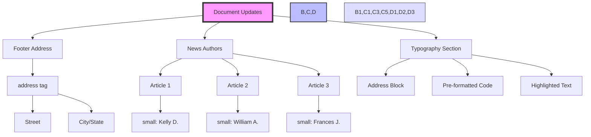

Points de vérification:
1. Task 31:
   - Adresse correctement formatée avec balise address
   - Saut de ligne avec br
   - Noms d'auteurs en small
   - Position correcte des noms d'auteurs

2. Task 32:
   - Section Typography avec header
   - Adresse formatée correctement
   - Code préformaté avec pre et code
   - Texte avec mots surlignés
   - Utilisation correcte de mark

# TASK 33: Table
**Fichier attendu:** 33-styleguide.html

```html
<section>
    <header>
        <h2>Table</h2>
    </header>
    <table>
        <caption>Star Wars Trilogy Data</caption>
        <thead>
            <tr>
                <th scope="col">Title</th>
                <th scope="col">Director</th>
                <th scope="col">Release Date</th>
            </tr>
        </thead>
        <tbody>
            <tr>
                <th scope="row">Star Wars: Episode IV - A New Hope</th>
                <td>George Lucas</td>
                <td>May 25th, 1977</td>
            </tr>
            <tr>
                <th scope="row">Star Wars: Episode V - The Empire Strikes Back</th>
                <td>Irvin Kershner</td>
                <td>May 21st, 1980</td>
            </tr>
            <tr>
                <th scope="row">Star Wars: Episode VI - Return of the Jedi</th>
                <td>Richard Marquand</td>
                <td>May 25th, 1983</td>
            </tr>
        </tbody>
    </table>
</section>
```

# TASK 34: Details
**Fichier attendu:** 34-styleguide.html

```html
<section>
    <header>
        <h2>Details</h2>
    </header>
    <div>
        <h3>Default</h3>
        <details>
            <summary>Show/Hide me</summary>
            <p>Pellentesque habitant morbi tristique senectus et netus et malesuada fames ac turpis egestas.</p>
        </details>
    </div>
    <div>
        <h3>Open</h3>
        <details open>
            <summary>Always open</summary>
            <p>Pellentesque habitant morbi tristique senectus et netus et malesuada fames ac turpis egestas.</p>
        </details>
    </div>
</section>
```

Structure visuelle:

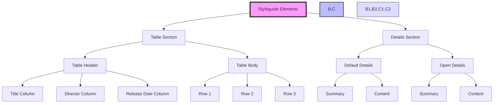

Points de vérification:
1. Task 33:
   - Structure complète de la table
   - Attributs scope corrects sur les th
   - En-têtes de colonnes
   - Données dans l'ordre correct

2. Task 34:
   - Deux éléments details
   - Premier fermé par défaut
   - Second ouvert par défaut (attribut open)
   - Texte exact dans les summary
   - Contenu identique dans les deux details

Points importants:
- Sémantique correcte des tableaux
- Accessibilité avec scope
- Structure des details/summary
- Organisation claire des sections

# TASK 35: Replace text logo with image logo
**Fichier attendu:** 35-index.html

Modifications dans le header et footer:

```html
<!-- Dans le header -->
<header>
    <div>
        <div>
            <a href="/">
                
            </a>
        </div>
        <nav>
            <!-- Navigation existante -->
        </nav>
    </div>
</header>

<!-- Dans le footer -->
<footer>
    
    <address>
        <!-- Adresse existante -->
    </address>
    <!-- Reste du contenu footer -->
</footer>
```

# TASK 36: Add images to your sections
**Fichier attendu:** 36-index.html

Ajouts des images dans différentes sections:

1. Works section:
```html
<section>
    <div>
        <div>
            
        </div>
        <h3>Interior Design</h3>
        <!-- Autres articles -->
    </div>
</section>
```

2. About Us section:
```html
<section>
    <div>
        
        <h3>Who are we</h3>
        <!-- Contenu existant -->
    </div>
</section>
```

3. Latest news section:
```html
<section>
    <div>
        <article>
            <div>
                
            </div>
            <!-- Contenu article -->
        </article>
        <!-- Répéter pour les autres articles -->
    </div>
</section>
```

4. Testimonials section:
```html
<section>
    <div>
        <article>
            
            <blockquote>
                <!-- Citation existante -->
            </blockquote>
        </article>
        <!-- Répéter pour les autres testimonials -->
    </div>
</section>
```

Structure visuelle :

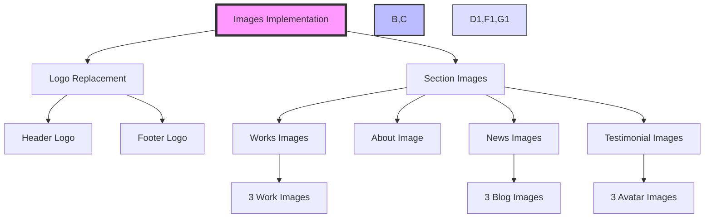

Points de vérification:
1. Pour les logos:
   - Dimensions correctes (160x40)
   - Alt text approprié
   - Placement correct dans header et footer

2. Pour les images de sections:
   - Dimensions spécifiées quand nécessaire
   - Alt text vide pour images décoratives
   - Alt text descriptif pour avatars
   - Structure div correcte
   - Noms de fichiers exacts

# TASK 37: Social icons
**Fichier attendu:** index.html

Remplacement des liens texte par des icônes SVG dans le footer :

```html
<footer>
    <div>
        <ul>
            <li>
                <a href="https://www.facebook.com/HolbertonSchool/">
                    <svg viewbox="0 0 24 24" xmlns="http://www.w3.org/2000/svg" width="25px" height="25px">
                        <title>Facebook icon</title>
                        <path d="M23.998 12c0-6.628-5.372-12-11.999-12C5.372 0 0 5.372 0 12c0 5.988 4.388 10.952 10.124 11.852v-8.384H7.078v-3.469h3.046V9.356c0-3.008 1.792-4.669 4.532-4.669 1.313 0 2.686.234 2.686.234v2.953H15.83c-1.49 0-1.955.925-1.955 1.874V12h3.328l-.532 3.469h-2.796v8.384c5.736-.9 10.124-5.864 10.124-11.853z"/>
                    </svg>
                </a>
            </li>
            <li>
                <a href="https://twitter.com/holbertonschool">
                    <svg viewbox="0 0 24 24" xmlns="http://www.w3.org/2000/svg" width="25px" height="25px">
                        <title>Twitter icon</title>
                        <path d="M23.954 4.569a10 10 0 0 1-2.825.775 4.958 4.958 0 0 0 2.163-2.723c-.951.555-2.005.959-3.127 1.184a4.92 4.92 0 0 0-8.384 4.482C7.691 8.094 4.066 6.13 1.64 3.161a4.822 4.822 0 0 0-.666 2.475c0 1.71.87 3.213 2.188 4.096a4.904 4.904 0 0 1-2.228-.616v.061a4.923 4.923 0 0 0 3.946 4.827 4.996 4.996 0 0 1-2.212.085 4.937 4.937 0 0 0 4.604 3.417 9.868 9.868 0 0 1-6.102 2.105c-.39 0-.779-.023-1.17-.067a13.995 13.995 0 0 0 7.557 2.209c9.054 0 13.999-7.496 13.999-13.986 0-.209 0-.42-.015-.63a9.936 9.936 0 0 0 2.46-2.548l-.047-.02z"/>
                    </svg>
                </a>
            </li>
            <li>
                <a href="https://www.instagram.com/holbertonschool/">
                    <svg viewbox="0 0 24 24" xmlns="http://www.w3.org/2000/svg" width="25px" height="25px">
                        <title>Instagram icon</title>
                        <path d="M12 0C8.74 0 8.333.015 7.053.072 5.775.132 4.905.333 4.14.63c-.789.306-1.459.717-2.126 1.384S.935 3.35.63 4.14C.333 4.905.131 5.775.072 7.053.012 8.333 0 8.74 0 12s.015 3.667.072 4.947c.06 1.277.261 2.148.558 2.913a5.885 5.885 0 0 0 1.384 2.126A5.868 5.868 0 0 0 4.14 23.37c.766.296 1.636.499 2.913.558C8.333 23.988 8.74 24 12 24s3.667-.015 4.947-.072c1.277-.06 2.148-.262 2.913-.558a5.898 5.898 0 0 0 2.126-1.384 5.86 5.86 0 0 0 1.384-2.126c.296-.765.499-1.636.558-2.913.06-1.28.072-1.687.072-4.947s-.015-3.667-.072-4.947c-.06-1.277-.262-2.149-.558-2.913a5.89 5.89 0 0 0-1.384-2.126A5.847 5.847 0 0 0 19.86.63c-.765-.297-1.636-.499-2.913-.558C15.667.012 15.26 0 12 0zm0 2.16c3.203 0 3.585.016 4.85.071 1.17.055 1.805.249 2.227.415.562.217.96.477 1.382.896.419.42.679.819.896 1.381.164.422.36 1.057.413 2.227.057 1.266.07 1.646.07 4.85s-.015 3.585-.074 4.85c-.061 1.17-.256 1.805-.421 2.227a3.81 3.81 0 0 1-.899 1.382 3.744 3.744 0 0 1-1.38.896c-.42.164-1.065.36-2.235.413-1.274.057-1.649.07-4.859.07-3.211 0-3.586-.015-4.859-.074-1.171-.061-1.816-.256-2.236-.421a3.716 3.716 0 0 1-1.379-.899 3.644 3.644 0 0 1-.9-1.38c-.165-.42-.359-1.065-.42-2.235-.045-1.26-.061-1.649-.061-4.844 0-3.196.016-3.586.061-4.861.061-1.17.255-1.814.42-2.234.21-.57.479-.96.9-1.381.419-.419.81-.689 1.379-.898.42-.166 1.051-.361 2.221-.421 1.275-.045 1.65-.06 4.859-.06l.045.03zm0 3.678a6.162 6.162 0 1 0 0 12.324 6.162 6.162 0 1 0 0-12.324zM12 16c-2.21 0-4-1.79-4-4s1.79-4 4-4 4 1.79 4 4-1.79 4-4 4zm7.846-10.405a1.441 1.441 0 0 1-2.88 0 1.44 1.44 0 0 1 2.88 0z"/>
                    </svg>
                </a>
            </li>
        </ul>
    </div>
</footer>
```

# TASK 38: Add a video player in the styleguide
**Fichier attendu:** 38-styleguide.html

```html
<section>
    <header>
        <h2>Video</h2>
    </header>
    <div>
        <video controls loop poster="https://intranet-projects-files.s3.amazonaws.com/webstack/thumbnail.jpg">
            <source src="https://intranet-projects-files.s3.amazonaws.com/webstack/BigBuckBunny.mp4" type="video/mp4">
            Sorry, your browser doesn't support HTML5 video
        </video>
    </div>
</section>
```

Structure visuelle:

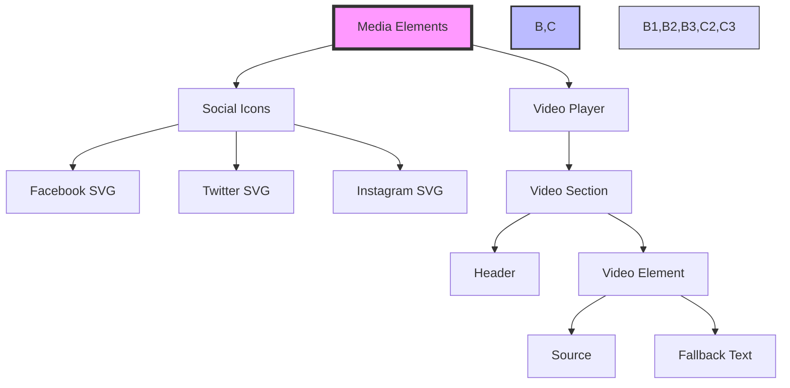

Points de vérification:
1. Task 37:
   - SVG remplace le texte pour chaque icône
   - Dimensions correctes (25x25)
   - Viewbox défini
   - Title dans chaque SVG
   - Liens conservés

2. Task 38:
   - Section vidéo après Details
   - Contrôles vidéo activés
   - Lecture en boucle activée
   - Poster/thumbnail défini
   - Message de fallback présent

# TASK 39: Add an audio player in the styleguide
**Fichier attendu:** 39-styleguide.html

```html
<section>
    <header>
        <h2>Audio</h2>
    </header>
    <div>
        <audio controls>
            <source src="https://intranet-projects-files.s3.amazonaws.com/webstack/TroubleChapter8_64kb.mp3" type="audio/mpeg">
            Sorry, your browser doesn't support audio element
        </audio>
    </div>
</section>
```

# TASK 40: Add an iframe example in the styleguide
**Fichier attendu:** styleguide.html (fichier final)

```html
<section>
    <header>
        <h2>Iframe</h2>
    </header>
    <div>
        <iframe 
            width="350" 
            height="200" 
            src="https://www.youtube.com/embed/41N6bKO-NVI" 
            title="Holberton School"
            >
            Holberton Sally
        </iframe>
    </div>
</section>
```

Structure finale complète du styleguide:

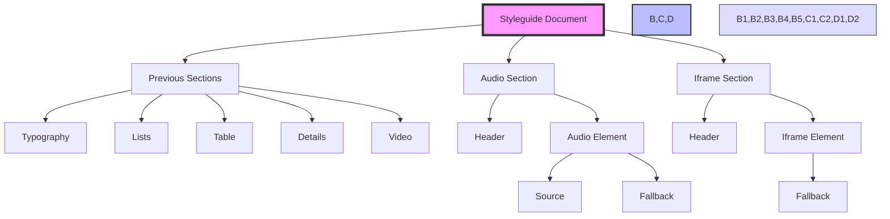

Points de vérification finaux:

1. Task 39:
   - Section audio après section vidéo
   - Contrôles audio présents
   - Source correcte
   - Message de fallback approprié
   - Structure header/div respectée

2. Task 40:
   - Section iframe en dernier
   - Dimensions correctes (350x200)
   - URL YouTube correcte
   - Titre spécifié
   - Texte de fallback présent

Vérifications globales du styleguide:
1. Structure générale:
   - Toutes les sections dans le bon ordre
   - Headers cohérents
   - Navigation claire

2. Contenu:
   - Tous les exemples présents
   - Formatage correct
   - Textes exacts

3. Médias:
   - Images
   - Vidéo
   - Audio
   - Iframe
   - SVG

4. Validation:
   - HTML sémantique
   - Accessibilité basique
   - Structure logique

