# Introduction
**Projet HTML Avancé**
- Niveau : Débutant
- Par : David Dias, Ingénieur Logiciel Senior chez HomeX
- Coefficient : 1

## Bienvenue !
Dans ce projet, vous apprendrez à utiliser les balises HTML pour structurer une page web. Pas de CSS, pas de style - ne vous inquiétez pas si la page finale est "laide", c'est normal et ce n'est pas le but de ce projet.

**Note importante** : Les détails sont importants ! Faites attention aux minuscules/majuscules et aux fautes de frappe.
```mermaid
graph TD
    A[HTML Avancé] --> B[Objectifs d'Apprentissage]
    A --> C[Ressources]
    A --> D[Exigences]
    A --> E[Structure du Projet]

    B --> B1[Comprendre les directives HTML]
    B --> B2[Créer un squelette HTML5]
    B --> B3[Utiliser les balises sémantiques]
    B --> B4[Maîtriser div vs span]
    B --> B5[Comprendre la valeur sémantique]

    C --> C1[Documentation HTML 5.2]
    C --> C2[MDN Web Docs]
    C --> C3[Guide de référence HTML]
    C --> C4[Tables de compatibilité]
    C --> C5[Aide-mémoire HTML]

    D --> D1[Fichier README.md obligatoire]
    D --> D2[Code validé W3C]
    D --> D3[Utilisation du nom Techium]

    E --> E1[Page d'accueil]
    E --> E2[À propos]
    E --> E3[Services]
    E --> E4[Contact]

```
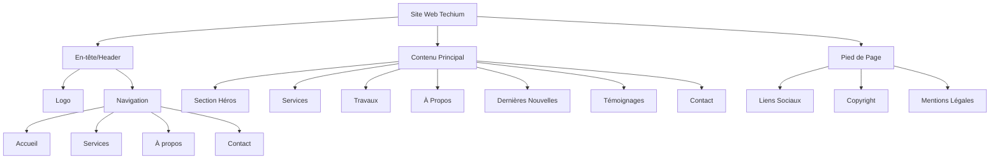

# Projet HTML Avancé - Documentation Complète

## 1. Objectifs d'Apprentissage

À la fin de ce projet, vous devrez pouvoir expliquer sans aide externe :

### Structure Fondamentale
- Comment créer le squelette d'une page HTML5
- L'utilisation correcte des balises sémantiques
- La différence entre `div` et `span`
- L'importance de la hiérarchie des titres

### Éléments Sémantiques
- La valeur sémantique des balises :
  * `header` (en-tête)
  * `main` (contenu principal)
  * `footer` (pied de page)
  * `article` (article)
  * `nav` (navigation)
  * `section` (section)
  * `aside` (contenu secondaire)

### Multimédia et Contenu
- Les différences entre les formats d'image :
  * SVG (graphiques vectoriels)
  * GIF (animations simples)
  * PNG (transparence)
  * JPG (photos)
- L'intégration de vidéos et audio
- L'incorporation de contenu externe

## 2. Ressources Recommandées

### Documentation Officielle
- HTML 5.2 (Spécification technique)
- MDN Web Docs (Guide complet)
- Guide de référence des éléments HTML
- Tables de compatibilité des navigateurs
- Aide-mémoire HTML

## 3. Exigences Techniques

### Fichiers et Structure
- Fichier `README.md` obligatoire
- Code validé par W3C-Validator
- Utilisation du nom "Techium"

### Organisation du Projet
```plaintext
projet/
├── README.md
├── index.html
├── about.html
├── services.html
└── contact.html
```

## 4. Plan du Site

### Pages Principales
1. **Accueil**
   - Section héros
   - Présentation des services
   - Points forts

2. **Services**
   - Liste détaillée
   - Tarification
   - Processus

3. **À Propos**
   - Histoire
   - Équipe
   - Vision

4. **Contact**
   - Formulaire
   - Coordonnées
   - Carte

## 5. Éléments HTML Essentiels

### Structure de Base
```html
<!DOCTYPE html>
<html lang="fr">
<head>
    <meta charset="UTF-8">
    <meta name="viewport" content="width=device-width, initial-scale=1.0">
    <title>Techium</title>
</head>
<body>
    <header>
        <!-- En-tête -->
    </header>
    <main>
        <!-- Contenu principal -->
    </main>
    <footer>
        <!-- Pied de page -->
    </footer>
</body>
</html>
```

### Points Importants
1. **Validation**
   - Code HTML valide
   - Structure sémantique
   - Accessibilité

2. **Organisation**
   - Structure claire
   - Hiérarchie logique
   - Nommage cohérent

3. **Bonnes Pratiques**
   - Indentation correcte
   - Commentaires utiles
   - Code propre

## 6. Points d'Attention Particuliers

### Accessibilité
- Textes alternatifs pour les images
- Structure de titres logique
- Navigation clavier possible

### Performance
- Images optimisées
- Code minimal
- Chargement efficace

### Compatibilité
- Support des navigateurs
- Dégradation gracieuse
- Validation W3C

## 7. Détails des Balises et Éléments HTML

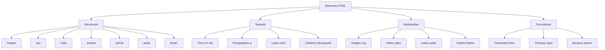

### Utilisation Détaillée des Balises

1. **Balises Structurelles**
```html
<!-- En-tête du site -->
<header>
    <nav>
        <ul>
            <li><a href="/">Accueil</a></li>
            <li><a href="/services">Services</a></li>
            <li><a href="/contact">Contact</a></li>
        </ul>
    </nav>
</header>

<!-- Contenu principal -->
<main>
    <section id="introduction">
        <h1>Bienvenue chez Techium</h1>
        <p>Votre partenaire digital</p>
    </section>

    <article>
        <h2>Nos Services</h2>
        <!-- Contenu de l'article -->
    </article>

    <aside>
        <!-- Contenu supplémentaire -->
    </aside>
</main>

<!-- Pied de page -->
<footer>
    <!-- Informations de contact -->
</footer>
```

2. **Éléments Textuels**
```html
<!-- Titres -->
<h1>Titre Principal</h1>
<h2>Sous-titre</h2>
<h3>Sous-section</h3>

<!-- Paragraphes et texte -->
<p>Texte normal</p>
<p><strong>Texte important</strong></p>
<p><em>Texte accentué</em></p>

<!-- Listes -->
<ul>
    <li>Élément non ordonné</li>
    <li>Autre élément</li>
</ul>

<ol>
    <li>Premier élément</li>
    <li>Deuxième élément</li>
</ol>
```

3. **Éléments Multimédias**
```html
<!-- Images -->


<!-- Vidéo -->
<video controls width="500">
    <source src="video.mp4" type="video/mp4">
    Votre navigateur ne supporte pas la vidéo
</video>

<!-- Audio -->
<audio controls>
    <source src="audio.mp3" type="audio/mpeg">
    Votre navigateur ne supporte pas l'audio
</audio>
```

4. **Tableaux**
```html
<table>
    <caption>Titre du tableau</caption>
    <thead>
        <tr>
            <th>En-tête 1</th>
            <th>En-tête 2</th>
        </tr>
    </thead>
    <tbody>
        <tr>
            <td>Donnée 1</td>
            <td>Donnée 2</td>
        </tr>
    </tbody>
</table>
```
## 8. Bonnes Pratiques et Accessibilité

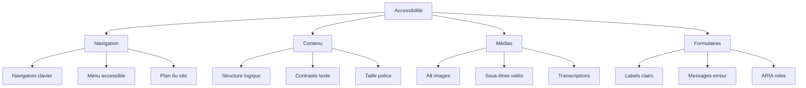

## 9. Optimisation et Performance

```html
<!-- Optimisation des images -->
<picture>
    <source media="(min-width: 800px)" srcset="grande-image.jpg">
    <source media="(min-width: 400px)" srcset="moyenne-image.jpg">
    
</picture>

<!-- Chargement différé -->


<!-- Préchargement des ressources critiques -->
<link rel="preload" href="fonts/mapolice.woff2" as="font" type="font/woff2" crossorigin>
```

## 10. Structure Complète d'une Page

```html
<!DOCTYPE html>
<html lang="fr">
<head>
    <meta charset="UTF-8">
    <meta name="viewport" content="width=device-width, initial-scale=1.0">
    <meta name="description" content="Techium - Services numériques professionnels">
    <title>Techium - Accueil</title>
    <!-- Favicon -->
    <link rel="icon" href="favicon.ico" type="image/x-icon">
</head>
<body>
    <!-- En-tête -->
    <header>
        <div class="logo">
            
        </div>
        <nav>
            <ul>
                <li><a href="#accueil">Accueil</a></li>
                <li><a href="#services">Services</a></li>
                <li><a href="#a-propos">À Propos</a></li>
                <li><a href="#contact">Contact</a></li>
            </ul>
        </nav>
    </header>

    <!-- Section principale -->
    <main>
        <!-- Section Héro -->
        <section id="hero">
            <h1>Solutions Digitales Innovantes</h1>
            <p>Transformez votre entreprise avec nos services numériques</p>
            <a href="#contact" class="cta">Contactez-nous</a>
        </section>

        <!-- Services -->
        <section id="services">
            <h2>Nos Services</h2>
            <div class="services-grid">
                <!-- Service 1 -->
                <article>
                    <h3>Développement Web</h3>
                    <p>Sites sur mesure et applications web performantes</p>
                </article>
                <!-- Service 2 -->
                <article>
                    <h3>Marketing Digital</h3>
                    <p>Stratégies marketing efficaces</p>
                </article>
            </div>
        </section>

        <!-- À Propos -->
        <section id="a-propos">
            <h2>À Propos de Techium</h2>
            <div class="about-content">
                
                <p>Experts en solutions numériques depuis 2010</p>
            </div>
        </section>

        <!-- Contact -->
        <section id="contact">
            <h2>Contactez-nous</h2>
            <form action="/submit" method="post">
                <div class="form-group">
                    <label for="nom">Nom:</label>
                    <input type="text" id="nom" name="nom" required>
                </div>
                <div class="form-group">
                    <label for="email">Email:</label>
                    <input type="email" id="email" name="email" required>
                </div>
                <button type="submit">Envoyer</button>
            </form>
        </section>
    </main>

    <!-- Pied de page -->
    <footer>
        <div class="footer-content">
            <div class="contact-info">
                <h4>Contact</h4>
                <address>
                    123 Rue de l'Innovation<br>
                    75000 Paris<br>
                    <a href="tel:+33123456789">01 23 45 67 89</a>
                </address>
            </div>
            <div class="social-links">
                <h4>Suivez-nous</h4>
                <a href="#" aria-label="Facebook">Facebook</a>
                <a href="#" aria-label="Twitter">Twitter</a>
                <a href="#" aria-label="LinkedIn">LinkedIn</a>
            </div>
        </div>
        <div class="copyright">
            <p>&copy; 2024 Techium. Tous droits réservés.</p>
        </div>
    </footer>
</body>
</html>
```
## 11. Optimisation SEO et Validation

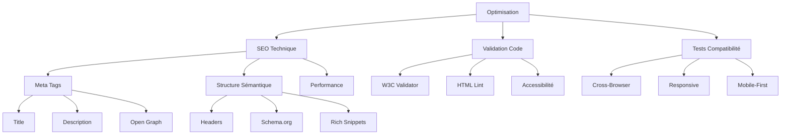

## 12. Meta Tags SEO

```html
<head>
    <!-- Meta tags de base -->
    <meta charset="UTF-8">
    <meta name="viewport" content="width=device-width, initial-scale=1.0">
    
    <!-- Meta tags SEO -->
    <title>Techium | Solutions Digitales Professionnelles</title>
    <meta name="description" content="Techium offre des services numériques innovants pour transformer votre entreprise. Expertise en développement web, marketing digital et solutions cloud.">
    <meta name="keywords" content="solutions digitales, développement web, marketing digital">
    
    <!-- Open Graph pour réseaux sociaux -->
    <meta property="og:title" content="Techium - Solutions Digitales">
    <meta property="og:description" content="Services numériques professionnels">
    <meta property="og:image" content="https://techium.com/images/og-image.jpg">
    <meta property="og:url" content="https://techium.com">
    
    <!-- Twitter Card -->
    <meta name="twitter:card" content="summary_large_image">
    <meta name="twitter:title" content="Techium">
    <meta name="twitter:description" content="Solutions numériques innovantes">
</head>
```

## 13. Données Structurées (Schema.org)

```html
<script type="application/ld+json">
{
  "@context": "https://schema.org",
  "@type": "Organization",
  "name": "Techium",
  "url": "https://techium.com",
  "logo": "https://techium.com/images/logo.png",
  "contactPoint": {
    "@type": "ContactPoint",
    "telephone": "+33-1-23-45-67-89",
    "contactType": "customer service"
  },
  "address": {
    "@type": "PostalAddress",
    "streetAddress": "123 Rue de l'Innovation",
    "addressLocality": "Paris",
    "postalCode": "75000",
    "addressCountry": "FR"
  }
}
</script>
```

## 14. Validation et Tests

1. **Liste de Contrôle HTML**:
```
✓ Doctype déclaré
✓ Langue spécifiée
✓ Encodage défini
✓ Viewport configuré
✓ Titres hiérarchiques
✓ Images avec alt
✓ Liens accessibles
✓ Formulaires étiquetés
```

2. **Optimisation Performance**:
```html
<!-- Préchargement des ressources critiques -->
<link rel="preconnect" href="https://fonts.googleapis.com">
<link rel="dns-prefetch" href="https://api.techium.com">

<!-- Images optimisées -->
<picture>
    <source type="image/webp" srcset="image.webp">
    <source type="image/jpeg" srcset="image.jpg">
    
</picture>

<!-- Vidéo optimisée -->
<video preload="none" poster="preview.jpg">
    <source src="video.mp4" type="video/mp4">
</video>
```

## 15. Tests de Compatibilité

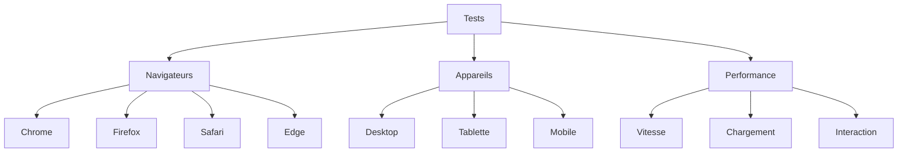
## 16. Techniques d'Optimisation Avancées

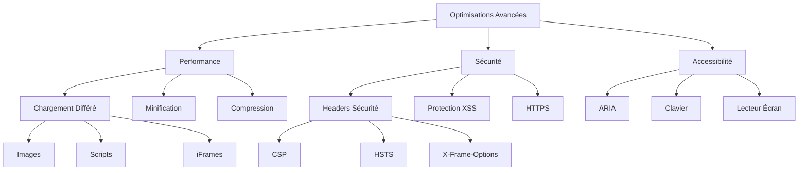

## 17. Implémentation de la Sécurité

```html
<!-- En-têtes de sécurité -->
<meta http-equiv="Content-Security-Policy" 
    content="default-src 'self'; img-src https://*; child-src 'none';">
<meta http-equiv="X-Frame-Options" content="DENY">
<meta http-equiv="X-XSS-Protection" content="1; mode=block">

<!-- Formulaire sécurisé -->
<form action="/submit" method="post" autocomplete="off">
    <!-- Protection CSRF -->
    <input type="hidden" name="csrf_token" value="token_value">
    
    <!-- Champs avec validation -->
    <input type="text" pattern="[A-Za-z0-9]+" required>
    <input type="email" pattern="[a-z0-9._%+-]+@[a-z0-9.-]+\.[a-z]{2,}$" required>
</form>
```

## 18. Optimisation des Ressources

```html
<!-- Préchargement intelligent -->
<link rel="preload" href="font.woff2" as="font" type="font/woff2" crossorigin>
<link rel="preload" href="critical.css" as="style">
<link rel="preload" href="main.js" as="script">

<!-- Images optimisées -->
<picture>
    <!-- WebP pour navigateurs modernes -->
    <source type="image/webp" 
            srcset="image-small.webp 300w,
                    image-medium.webp 600w,
                    image-large.webp 900w"
            sizes="(max-width: 320px) 280px,
                   (max-width: 640px) 580px,
                   800px">
    <!-- Fallback JPG -->
    
</picture>
```

## 19. Accessibilité Avancée

```html
<!-- Navigation accessible -->
<nav role="navigation" aria-label="Menu principal">
    <ul>
        <li><a href="#" role="menuitem">Accueil</a></li>
        <li>
            <button aria-expanded="false" aria-controls="submenu">
                Services
                <span class="sr-only">(sous-menu)</span>
            </button>
            <ul id="submenu" hidden>
                <li><a href="#" role="menuitem">Web</a></li>
                <li><a href="#" role="menuitem">Mobile</a></li>
            </ul>
        </li>
    </ul>
</nav>

<!-- Contenu skip link -->
<a href="#main-content" class="skip-link">
    Aller au contenu principal
</a>

<!-- Formulaire accessible -->
<form role="form" aria-labelledby="form-title">
    <h2 id="form-title">Formulaire de Contact</h2>
    
    <div role="group" aria-labelledby="personal-info">
        <h3 id="personal-info">Informations Personnelles</h3>
        
        <label for="name" class="sr-only">Nom</label>
        <input type="text" 
               id="name" 
               aria-required="true"
               aria-describedby="name-help">
        <span id="name-help" role="tooltip">
            Entrez votre nom complet
        </span>
    </div>
</form>
```

## 20. Outils de Développement Recommandés

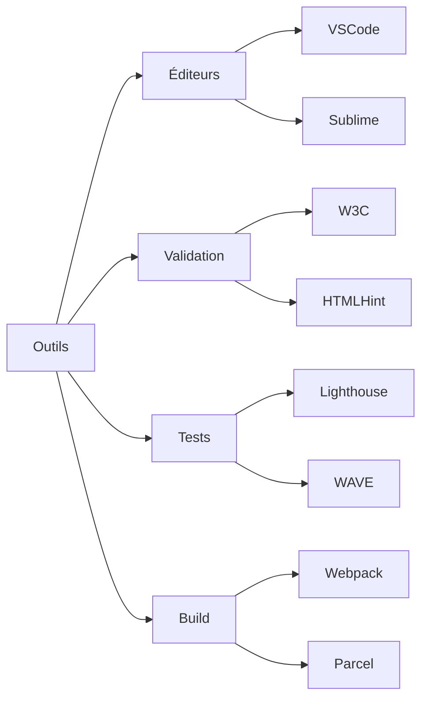
## 21. Optimisation Mobile-First

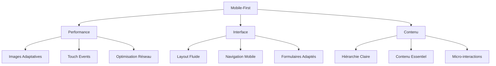

## 22. Code Mobile-First Example

```html
<!-- Configuration de base mobile-first -->
<head>
    <meta name="viewport" content="width=device-width, initial-scale=1.0">
    <meta name="theme-color" content="#4285f4">
    <link rel="manifest" href="/manifest.json">
    
    <!-- Touch Icons -->
    <link rel="apple-touch-icon" sizes="180x180" href="/apple-touch-icon.png">
    <meta name="apple-mobile-web-app-capable" content="yes">
    <meta name="apple-mobile-web-app-status-bar-style" content="black">
</head>

<!-- Menu mobile optimisé -->
<nav class="mobile-nav">
    <button aria-label="Menu" class="menu-toggle">
        <span class="menu-icon"></span>
    </button>
    
    <div class="menu-container" hidden>
        <ul class="menu-items">
            <li><a href="#" class="touch-target">Accueil</a></li>
            <li><a href="#" class="touch-target">Services</a></li>
            <li><a href="#" class="touch-target">Contact</a></li>
        </ul>
    </div>
</nav>

<!-- Formulaires optimisés mobile -->
<form class="mobile-form">
    <input type="tel" 
           pattern="[0-9]{10}"
           inputmode="numeric"
           autocomplete="tel">
    
    <input type="email"
           inputmode="email"
           autocomplete="email">
           
    <button type="submit" class="touch-target">
        Envoyer
    </button>
</form>
```

## 23. Techniques de Débogage Avancées

```html
<!-- Balises de débogage -->
<div data-debug="layout">
    <div data-debug="header">
        <!-- Contenu -->
    </div>
</div>

<!-- Console.log intégré -->
<script>
    console.group('Vérification de la page');
    console.log('Chargement DOM:', performance.now());
    console.groupEnd();
</script>

<!-- Points de repère de performance -->
<script>
    performance.mark('début-chargement');
    // ... contenu ...
    performance.mark('fin-chargement');
    performance.measure('temps-total', 
        'début-chargement', 
        'fin-chargement');
</script>
```

## 24. Intégration avec d'Autres Technologies

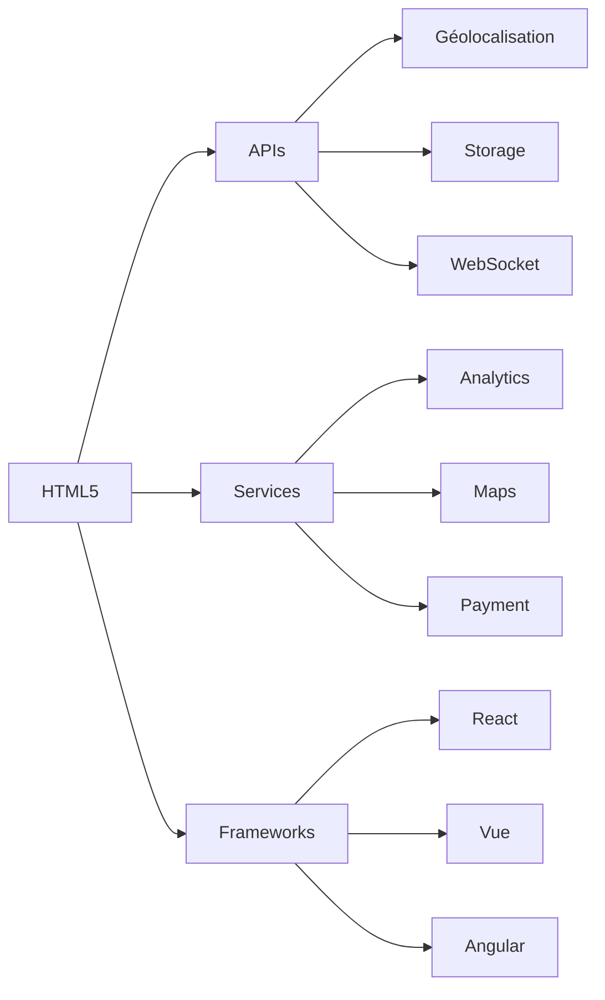

## 25. Exemple d'Intégrations

```html
<!-- Intégration API Géolocalisation -->
<button onclick="getLocation()">
    Localiser
</button>
<div id="location"></div>

<!-- Intégration Google Maps -->
<div id="map"
     data-lat="48.8566"
     data-lng="2.3522"
     data-zoom="13">
</div>

<!-- Intégration Paiement -->
<div class="payment-container"
     data-price="99.99"
     data-currency="EUR">
    <button data-payment="stripe">
        Payer avec Stripe
    </button>
    <button data-payment="paypal">
        Payer avec PayPal
    </button>
</div>
```

## 26. Cas d'Utilisation Spécifiques

### E-commerce
```html
<article class="product">
    
         
    <div class="product-info">
        <h2>Nom du Produit</h2>
        <p class="price">99,99 €</p>
        
        <form class="add-to-cart">
            <select name="size" required>
                <option value="">Choisir une taille</option>
                <option value="S">S</option>
                <option value="M">M</option>
                <option value="L">L</option>
            </select>
            
            <button type="submit">
                Ajouter au panier
            </button>
        </form>
    </div>
</article>
```
Vous avez raison. Recentrons-nous sur les objectifs de base du projet HTML avancé. Résumons et finalisons les points essentiels demandés dans les requirements :

## Résumé Final des Points Clés

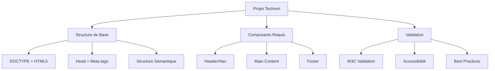

## Structure Finale Recommandée

```html
<!DOCTYPE html>
<html lang="fr" dir="ltr">
<head>
    <meta charset="UTF-8">
    <meta name="viewport" content="width=device-width, initial-scale=1.0">
    <title>Techium</title>
    <meta name="description" content="Description de Techium">
    <link rel="icon" href="favicon.ico" type="image/x-icon">
</head>
<body>
    <!-- Header -->
    <header>
        <div>
            <a href="/"><span>Techium</span></a>
            <nav>
                <!-- Navigation -->
            </nav>
        </div>
    </header>

    <!-- Main -->
    <main>
        <h1>Titre Principal</h1>
        <!-- Sections requises -->
        <section>
            <h2>Section Titre</h2>
            <article>
                <h3>Article Titre</h3>
            </article>
        </section>
    </main>

    <!-- Footer -->
    <footer>
        <div>
            <!-- Contenu footer -->
        </div>
    </footer>
</body>
</html>
```

## Liste de Vérification Finale

1. Structure HTML5 correcte
2. Balises sémantiques appropriées
3. Hiérarchie des titres logique
4. Navigation accessible
5. Code W3C validé


## to be continued ...
